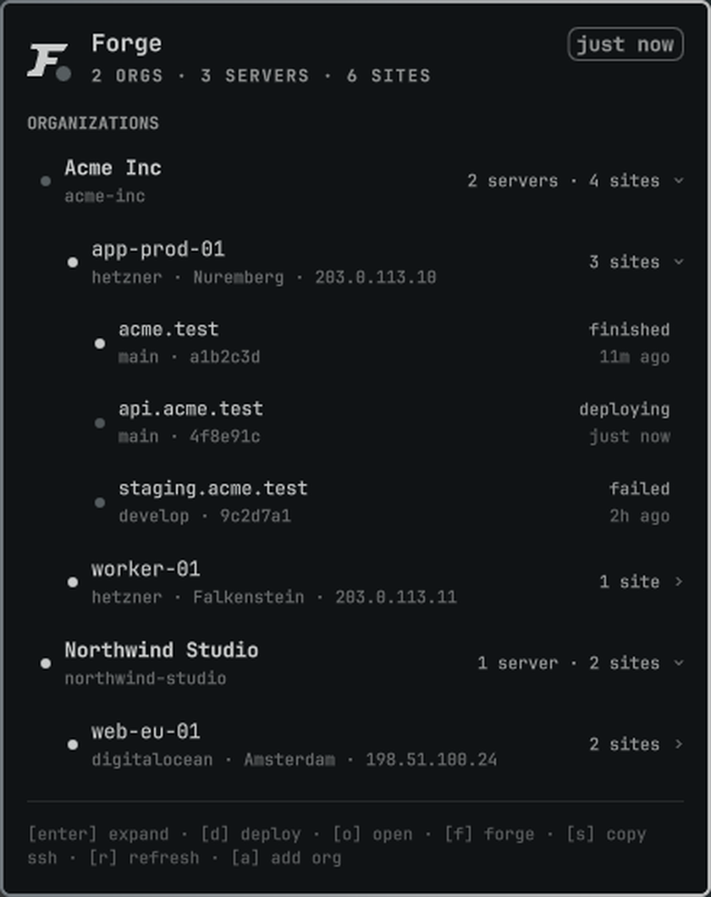
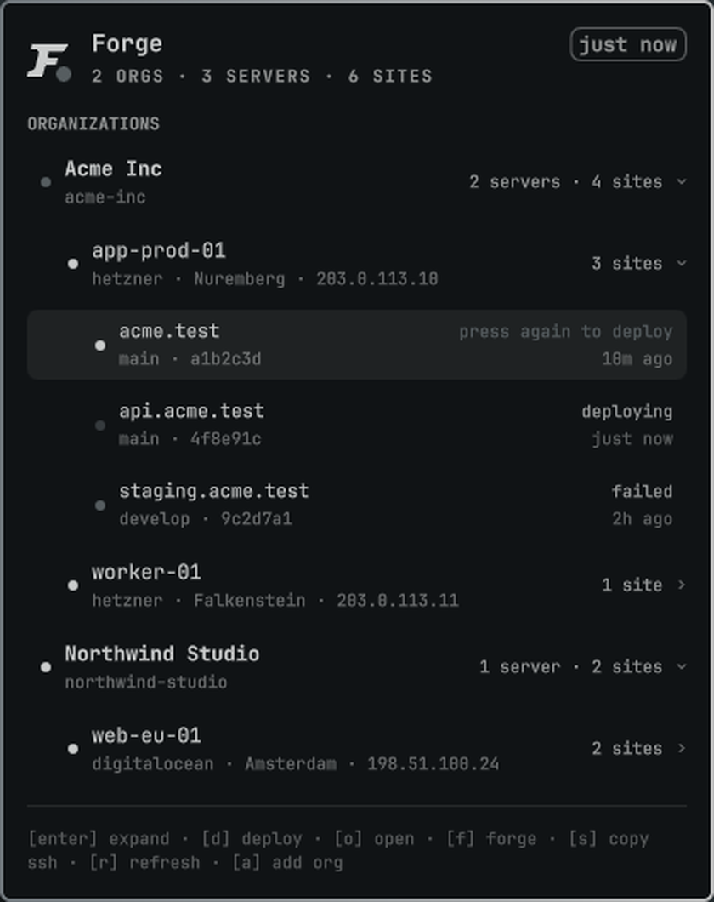

# Forge

[Laravel Forge](https://forge.laravel.com) servers and deployments in the [Omarchy](https://omarchy.org/)
bar. The icon tells you whether anything is broken; the panel tells you what, and lets you redeploy
it without opening a browser. One icon covers every organization you have a token for, however many
Forge accounts those tokens belong to.

Built on the Forge **v2** API. The v1 API was discontinued on 31 August 2026 and nothing here uses it.



## Install

```sh
omarchy plugin add https://github.com/acobrerosf/omarchy-forge.git --enable
```

Then set up the token, either from the panel's **Set up Forge** button or from a terminal:

```sh
~/.config/omarchy/plugins/acobrerosf.forge/omarchy-forge setup
```

Create the token at <https://forge.laravel.com/profile/api>. The scopes it needs:

| Scope | Why |
|---|---|
| `user:view` | confirm the token works during setup |
| `organization:view` | find the organizations to watch |
| `server:view` | read servers, sites, and deployment status |
| `site:manage-deploys` | **only** if you want to deploy from the bar |

Leave `site:manage-deploys` off and the widget is strictly read-only — the deploy key does nothing
but report that the token isn't allowed to.

Tokens go into the login keyring via `secret-tool`, not into a config file. The widget never
handles them: every request is made by the bundled `omarchy-forge` helper, which reads the token
itself and passes it to curl on stdin, so it never appears in a command line or an environment
anything else can read.

## Organizations

One token belongs to an **account**; an account can see several **organizations**; an organization is
watched through exactly one account. A token that already sees three organizations only needs adding
once. An organization that belongs to somebody else's Forge account needs a token of its own.

Either way it is the same command — from the panel (`a`, or the **Add organization** button) or from
a terminal:

```sh
omarchy-forge add
```

It asks for a token and then lets you pick which of that token's organizations to watch.

It does not ask you to name anything. The **account name** is a handle for this CLI — the argument
to `--account` — and never appears in the bar, so it is derived from whoever the token belongs to
rather than requested. Two Forge accounts sharing an email local part get distinct handles, and a
derived name never lands on an account that already exists. `omarchy-forge accounts` lists them,
and `omarchy-forge rename <old> <new>` changes one; `omarchy-forge add --name <handle>` sets it up
front. What the bar shows is the **organization** name, which comes from Forge. Organizations another account already watches are
skipped rather than fought over, since a slug is only ever one organization. Handing it a token it
already holds updates that account instead of starting a second one — one Forge account is one
entry in the keyring and one rate-limit budget, however many times you paste its token.

To replace a token rather than add one — after rotating it, say:

```sh
omarchy-forge login --account clientco
```

```sh
omarchy-forge accounts        # who is configured, and what each one watches
omarchy-forge remove acme     # stop watching one organization
omarchy-forge remove --account clientco   # drop an account, its token, and its orgs
```

The panel shows all of them in one list, grouped under a foldable heading per organization, and the
bar icon reports the worst thing among them. Nothing needs restarting: adding an organization is
picked up within a refresh interval.

## What it shows


Forge's own mark sits in the bar, second from the left above. It carries one badge for everything
being watched:

| Badge | Meaning |
|---|---|
| none | every server is up and no deployment is failing |
| pulsing | a deployment is running |
| solid | a server is unreachable or revoked, or a deployment failed |
| warning | no token yet, an account's token is missing, or the last request errored |

Each organization unfolds into its servers, and each server into its sites with the state of their
latest deployment, the branch, and the commit. A server whose site starts failing unfolds itself,
once — collapse it again and it stays collapsed.

Deployments that finish or fail between refreshes raise a desktop notification, which names the
organization when more than one is being watched. Clicking it opens the site.

A missing or rejected token is reported once per account rather than once per organization behind
it, because that is where the problem actually is.

## Keys

| Key | Action |
|---|---|
| `j` `k` or arrows | move the cursor |
| enter / space | unfold an organization or a server, or arm a site for deploy — unfolding a server also refreshes its sites |
| `d` | deploy the site under the cursor |
| `o` | open the site's URL — or, on a server row, its page in Forge |
| `f` | open the row's page in the Forge dashboard |
| `s` | copy an `ssh forge@…` command for the server |
| `r` | refresh now |
| `a` | add an organization |
| esc | close |

Deploying takes two presses. The first arms the row and says so; the second sends it. The arm
expires after four seconds.



Mouse: left click a row to unfold or arm it, right click to open it in Forge. Middle click the bar
icon to refresh.

## The rate limit

Forge allows **60 requests a minute per user** — per Forge account, that is, shared with anything
else on it, including Forge's own dashboard if you have it open.

Each account therefore gets its own budget, and the widget keeps a separate ledger for each. Two
tokens issued by the *same* person share one budget and are tracked as one, which is why setup
records who a token belongs to.

One refresh costs **two requests per organization**, whatever the server count: one for the server
list, one for every site in the organization with its latest deployment folded in
(`?include=server,latestDeployment`). Five servers or fifty, it is the same two a minute at the
default 60-second interval. A list longer than 30 rows costs one more request per extra page, since
that is how Forge hands long lists out, up to five pages a refresh. An organization with more than
150 sites is walked **in rotation**: each refresh checks the next slice of the list and the panel
says so, nothing already on screen is dropped meanwhile, and full coverage arrives over a few
refreshes rather than in one. The trade is that a status change at the far end of the rotation is
noticed up to one rotation late; unfolding a server fetches that server's sites fresh right then
(one extra request, held back for 15 seconds between asks), and sites keep whatever status their
last look saw until the walk comes around again.

That figure does not change with the number of screens. Polling lives in a single service the
shell loads once per session, not in the bar widget — which is created once per monitor. Two
copies of the widget watching the same organization share one poll, and a deployment notifies
once rather than once per screen.

The site sweep for an organization is still dropped for that tick if it would take its account's
last minute over 40 requests, and the panel says so — but at one request it takes a lot of
organizations on one Forge account to get there. A server list is never dropped, because the bar
icon depends on it.

That ledger only counts what the widget itself spent, so Forge can still refuse a request — the
dashboard in a browser tab is spending the same minute. When it does, the panel says "rate limited"
and everything on that Forge account stops until the limit resets: queued work is dropped rather
than sent, refreshes wait, and a deploy tells you how many seconds are left instead of asking again.
It resumes on its own. Forge says when the reset is due on the response that refuses; if it doesn't,
the wait is a minute.

Turning **Watch deployments** off halves that again, to one request per organization per tick, at
the price of showing server health only. With the cost no longer growing with your server count,
there is rarely a reason to.

## Settings

Bar widget settings, editable in Setup → Plugins or directly in `~/.config/omarchy/shell.json`:

| Key | Default | What |
|---|---|---|
| `refreshIntervalSec` | `60` | seconds between refreshes (15–3600) |
| `watchDeployments` | `true` | also fetch sites and deployment status |
| `notifyDeployments` | `true` | notify when a deployment finishes or fails |
| `organization` | `""` | which organizations this copy shows — empty for all of them |
| `dashboardUrlTemplate` | `https://forge.laravel.com/{org}/{server}/{site}` | where `f` and right-click point — `{org}`/`{server}` are slugs, `{site}` an id, `{serverId}` also available; must be an `http`/`https` address |

`organization` is a filter over what the helper is watching, not a second place to configure one.
Empty shows everything; a slug narrows the widget to that organization; a comma-separated list
narrows it to those. `allowMultiple` is still on, so you can put a second copy in the bar pinned to
one organization if you would rather have separate icons — each organization is polled on its own
schedule, and where two widgets want the same one, the shorter of their two intervals wins and they
share the result.

## The CLI

`omarchy-forge` works on its own, and is useful for scripting even if you never open the panel:

```sh
omarchy-forge setup           # guided setup, and how a second organization gets added later
omarchy-forge add             # store a token and pick which of its organizations to watch
omarchy-forge accounts        # accounts, tokens, and what each one watches
omarchy-forge orgs [account]  # organizations a token can see
omarchy-forge org [slug]      # show or set the default organization
omarchy-forge remove <slug>   # stop watching an organization
omarchy-forge remove --account NAME        # drop an account, its token, and its orgs
omarchy-forge rename OLD NEW               # give an account a different CLI handle
omarchy-forge login --account NAME         # replace the token on an account
omarchy-forge logout [account]             # remove an account's token
omarchy-forge status [--org SLUG]          # server health as a table
omarchy-forge doctor          # every account: token, auth, rate limit left
omarchy-forge api --account default GET /orgs/acme/servers   # raw request, JSON envelope
```

To have it on your `PATH`:

```sh
ln -sf ~/.config/omarchy/plugins/acobrerosf.forge/omarchy-forge ~/.local/bin/omarchy-forge
```

`api` always prints one envelope, whatever went wrong:

```json
{"ok": true, "status": 200, "rateRemaining": 57, "rateReset": null, "body": { }, "error": null}
```

`rateReset` is how many seconds are left before the limit resets, or `null` — Forge only says when
it is the response refusing you.

`--account` names the credential to use and `--org` picks it by which organization owns it; with
neither, the account behind the default organization is used. `$FORGE_TOKEN` overrides the keyring
for that one account, for CI or for trying a token without storing it — set `$FORGE_ACCOUNT`
alongside it to say which.

State lives in `~/.local/state/omarchy/forge.json`: which accounts exist, which organizations each
one reaches, and which is the default. Tokens are never in there.

## Requirements

- Omarchy 4.0 or newer (the Quickshell plugin host)
- `curl`, `jq`, `secret-tool` — all present on a stock Omarchy install
- `wl-copy` for the copy action
- `gum`, optionally — it makes picking organizations nicer; there is a numbered fallback without it

## Known gaps

- **The dashboard URL is a template, not something derived.** The Forge API never hands out a web
  link, so `dashboardUrlTemplate` is a setting. `{org}` and `{server}` are slugs, `{site}` is an id;
  `{serverId}` is available if you need the numeric server id instead. Note that a server's
  slug is fixed at creation and does not follow a rename, which is why it has to come from the API
  rather than be derived from the name.
- Server actions — reboot, restarting nginx or PHP — are deliberately not here yet. Deploying is
  the one write this version does.
- **The server list stops at 150 rows.** Forge returns 30 rows a page — whatever `page[size]` asks
  for — and points at the rest with a cursor. The widget follows it, up to five pages per refresh,
  or until the account's minute is nearly spent, and says "showing the first 150 servers" rather
  than quietly showing a prefix. Sites are no longer capped this way: past 150 the list is checked
  in rotation across refreshes (see the rate limit section), so every site is watched, just not all
  in the same minute. `omarchy-forge` on the command line still stops at five pages and warns on
  stderr; `FORGE_MAX_PAGES` raises its cap for a one-off run.
- **Notification text is scrubbed harder than it should need to be.**
  `omarchy-notification-send` passes the headline and the description to `notify-send` as bare
  positionals with no `--` in front of them, so both its own option loop and notify-send's GLib
  parser — which permutes, and so reads options *after* positionals — take a leading `-` as a
  flag. A site named `--hint=string:omarchy-exec:…` would become the command the toast runs when
  clicked. This plugin defends itself by stripping leading hyphens and control characters from
  both strings, so a site name that starts with a hyphen loses it in the notification. The real
  fix is one line in `/usr/bin/omarchy-notification-send` — `notify-send "${args[@]}" --
  "$headline" "$description"` — which protects every other plugin too, but that script is
  package-owned, so it is a report to file upstream rather than something this repo can change.

## License

MIT
